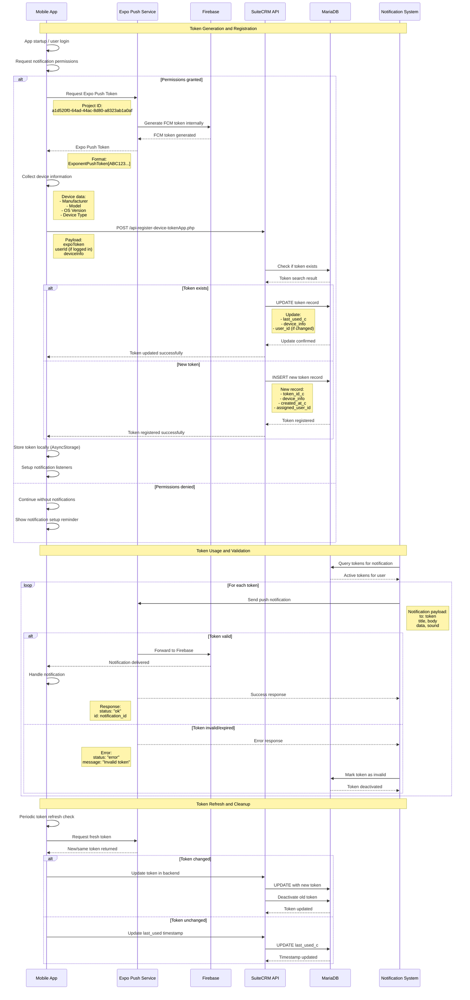

# Notification Token Lifecycle Flow

## Overview

This diagram describes the complete lifecycle of push notification tokens in the Central156 system, from generation to expiration and renewal.

## Token Lifecycle Architecture

